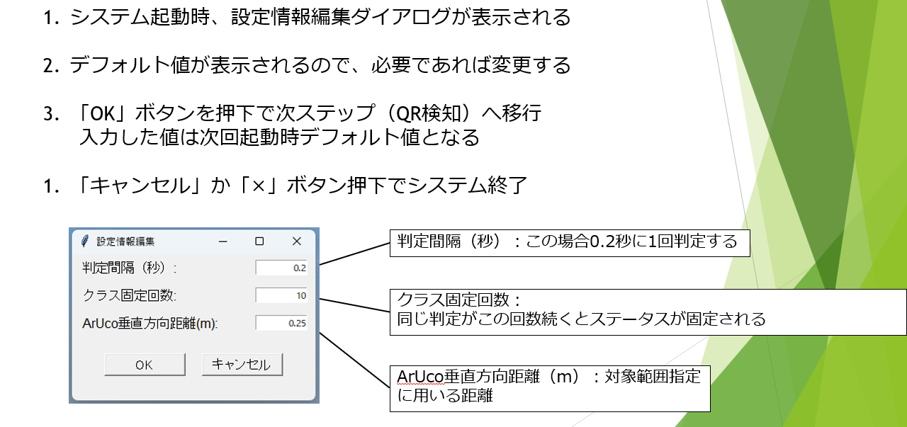
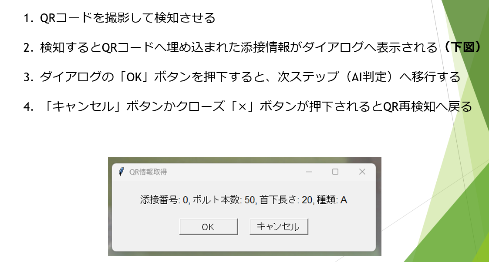
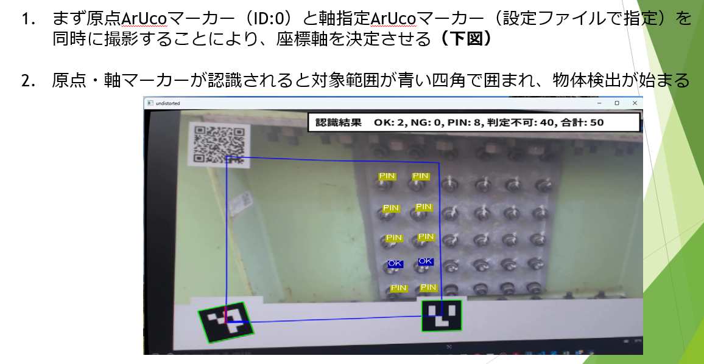
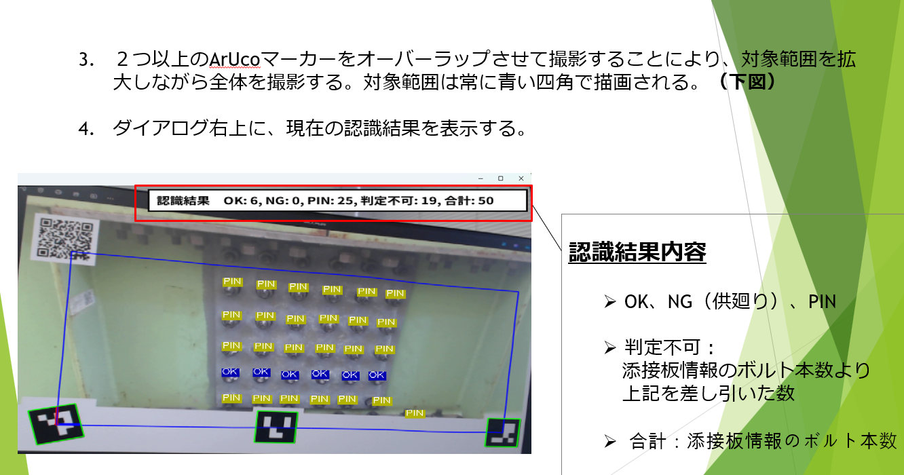
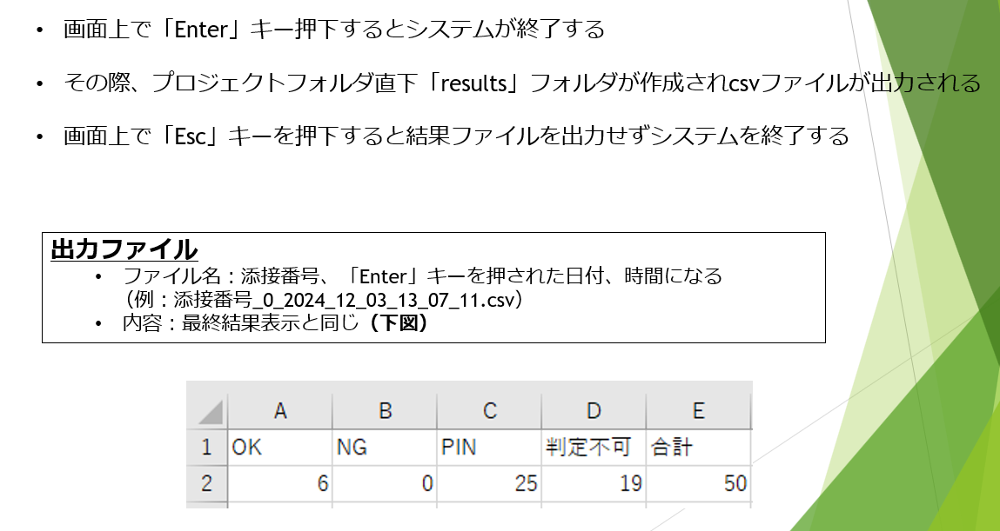

# BoltDetection_MHI
ボルト判定　　

１．環境構築 (テスト python 3.10)　 
py -3.10 -m venv venv　 
venv\Scripts\activate　 
pip install -r requirements.txt 

２．実行 
python __main__.py 
-------------------------------- 
システム詳細 
①設定情報編集 
 
②QR検知 
 
③ボルト判定 
 
 
④システム終了・出力ファイル 
